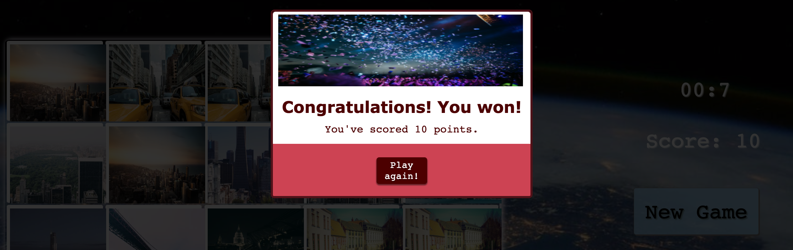

# Memory Game 
 

 The aim in this project is to challenge the players memory. The layout of the game is simple and the comands are intuitive. The background image and the pictures in the game cards are part of the same theme. There is a painel that display time and score in order to make the game more informative.

## Features 

### Existing Features

 > The Memory game Logo and Heading

 

 > The Game Area
  - This section will allow the user to click on the cards and flip them and revels what image its behing the card. The gamer will have choose two cards and if they are not the same they will flip back imediately. given the game a option to chose other cards.

 

 >  The game painel
 - This section will allow the user to see the time remaining for the game finish, the score obtained when the time finshes and the restart button. 

 

 > The win pop-up box
 - The win pop-up box will only appers if the gamer manges to gather 10 matching cards under 60 seconds. 

 

  > The lose pop-up box
   - The lose pop-up box will only appers after 60 seconds when the gamer did not acomplish the 10 cards matching.

  

   > The footer section

## Features Left to Implement
 - One the features that I would like to have had implemented were a record of previous scores and time. 

# Validator Testing

### HTML
 - No errors were returned when passing through the official W3C validator.
### CSS
 - No errors were found when passing through the official (Jigsaw) validator.
### JavaScript
 - No errors were found when passing through the official Jshint validator
 - The following metrics were returned:
 - There are 11 functions in this file.
 - Function with the largest signature takes 2 arguments, while the median is 0.
 - Largest function has 10 statements in it, while the median is 3.
 - The most complex function has a cyclomatic complexity value of 4 while the median is 2.

## Unfixed Bugs
  
You will need to mention unfixed bugs and why they were not fixed. This section should include shortcomings of the frameworks or technologies used. Although time can be a big variable to consider, paucity of time and difficulty understanding implementation is not a valid reason to leave bugs unfixed.

## Deployment
This project was deployed using GitHub pages.
The procedure for doing this is very straight forward.

- The site was deployed to GitHub pages. The steps to deploy are as follows:
 * In the GitHub repository, navigate to the Settings tab
 * From the source section drop-down menu, select the Master Branch
 * Once the master branch has been selected, the page will be automatically refreshed with a detailed ribbon display to indicate the successful deployment.

The live link can be found here - 

## Credits

- Content 
* The idea of the game was 
*
*

- Media

* All images were gathered from Picsum
* [Pic-Sum Photos](https://picsum.photos/)

## Technologies Used 

- [HTML](https://devdocs.io/html/)
- [CSS](https://www.w3.org/Style/CSS/Overview.en.html)
- [JavaScript](https://developer.mozilla.org/en-US/docs/Web/javascript)
- [GitHub](https://github.com/)
- [GitPod](https://www.gitpod.io/docs/)
- [Visual Studio Code](https://code.visualstudio.com/Docs)
- [FontAwesome](https://fontawesome.com/docs)
- [Google fonts](https://fonts.google.com/)

#### Resources

- [Code Institute Curriculum](https://codeinstitute.net/ie/)
- [YouTube](https://www.youtube.com/)
- [Udemy](https://www.udemy.com/)
- [FreeCodeCamp](https://www.freecodecamp.org/)
- [W3Schools.com](https://www.w3schools.com/)
- [MDN Web Docs](https://developer.mozilla.org/en-US/)

---

## Acknowledgements
I would like to thank my mentor Chris Quinn and my friend Ishan Sethy. The support they gave me were essencial for the development of this project. I also relied on the chat groups of the Slack community of Code Institute and lots You Tube. 
In conclusion Javascript open my eyes despite the dificult to understand it at first, but eventually start to function in it. 

